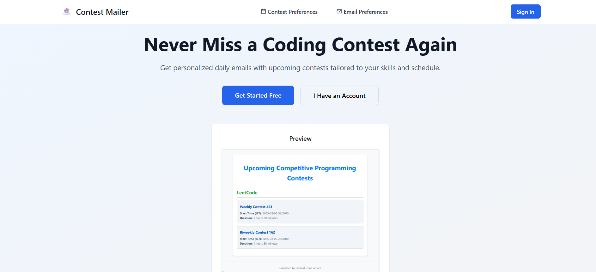
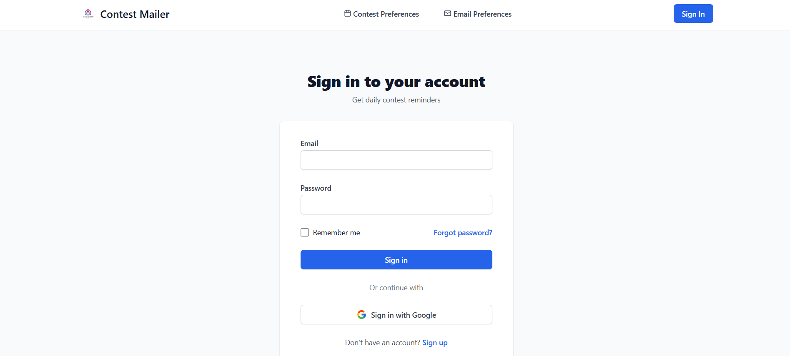
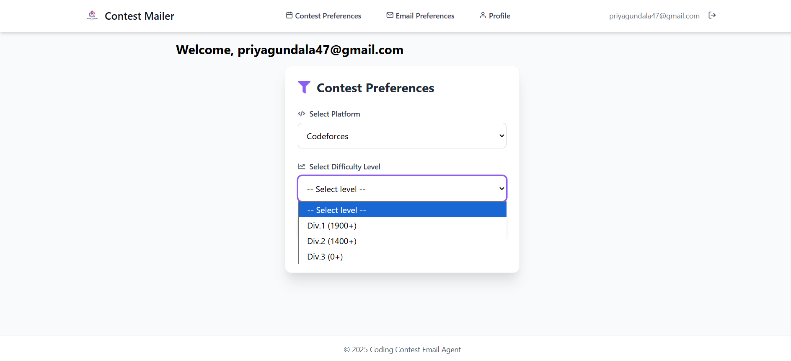
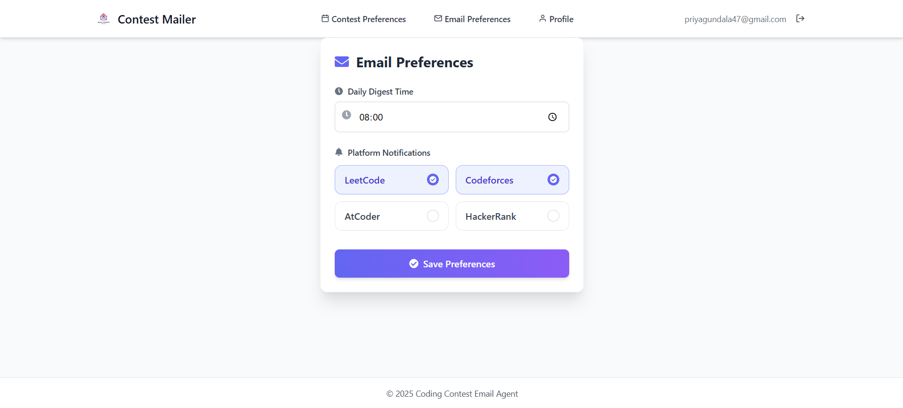
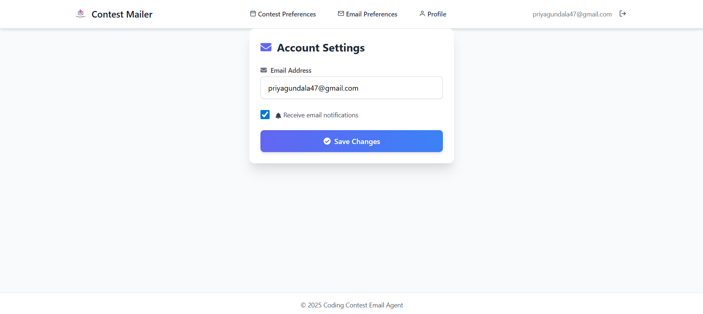

# 🚀 Coding Contest Service Agent

An intelligent assistant that automatically emails users beautiful PDF summaries of upcoming coding contests based on their selected platforms and time preferences. Built using React, Node.js, MongoDB, and Gemini AI.

---

## 📌 Features

- 🔐 Google OAuth login
- 📅 Personalized contest scheduling
- 🧠 Gemini-powered smart summaries
- 📨 Sends contest summaries in PDF via email
- 💾 Saves user preferences (platforms, time) in MongoDB
- ⚙️ Scheduled email dispatch using Node cron
- 🧪 Fully working frontend and backend with connected logic


## 🖼️ Main Page Screenshot



## 🔐 Sign In Page Screenshot



## 📝 Sign Up Page Screenshot


## ⚙️ Contest Preferences Screenshot



## 📧 Email Preferences Screenshot



## 🔔 Email Settings Screenshot



## 📬 Email Preview Screenshot


## 🧰 Tech Stack

| Category         | Technology                                      |
|------------------|--------------------------------------------------|
| Frontend         | React, Tailwind CSS, React Router               |
| Backend          | Node.js, Express.js                             |
| Database         | MongoDB, Mongoose                               |
| Authentication   | Google OAuth 2.0 (Frontend & Backend)           |
| PDF Generation   | PDFKit                                          |
| Email Service    | Nodemailer (Gmail OAuth2 + Scheduled Cron Jobs) |
| AI Summarizer    | Google Gemini API                               |
| State Management | useState, useEffect (React Hooks)               |
| Scheduling       | node-cron                                       |
| API Communication| Fetch API / Axios                               |
| Environment Mgmt | dotenv                                          |

---

## 🛠️ How to Run Locally

### 1. Clone Repository

```bash
git clone https://github.com/bhargav8985/CodingContestServiceAgent.git
cd CodingContestServiceAgent
```
## 🚀 Setup Instructions

### Backend Setup

```bash
cd backend
npm install
npm start
```

The backend server will run at `http://localhost:5000`.

### Frontend Setup

```bash
cd client
npm install
npm start
```

The frontend application will be available at `http://localhost:3000`.

## 🌐 Environment Variables

Create a **`.env`** file inside the `backend/` directory with the following variables:

```env
# MongoDB
MONGO_URI=your_mongodb_uri

# Google OAuth
GOOGLE_CLIENT_ID=your_google_client_id
GOOGLE_CLIENT_SECRET=your_google_client_secret
CLIENT_URL=http://localhost:3000

# Nodemailer Gmail OAuth
GMAIL_CLIENT_ID=your_gmail_client_id
GMAIL_CLIENT_SECRET=your_gmail_client_secret
GMAIL_REFRESH_TOKEN=your_refresh_token
GMAIL_EMAIL=your_email@gmail.com

# Server
PORT=your_port_number
SESSION_SECRET=your_session_secret

# Gemini API
GEMINI_API_KEY=your_gemini_api_key
```

## 🧠 How It Works

1.  **User login**: The user authenticates using their Google account or using sign up on the application.
2.  **Selects preferred platforms and time**: The user can customize which contest platforms they want to follow and when they want to receive the email.
3.  **Preferences stored in MongoDB**: The user's preferences are saved in a MongoDB database.
4.  **Cron job checks preferences daily**: A scheduled job runs every day to check for new contests based on user preferences.
5.  **Gemini API summarizes contest data**: The Gemini API is used to summarize the contest information.
6.  **PDF generated using PDFKit**: A PDF summary is created using the PDFKit library.
7.  **Email sent via Nodemailer**: The PDF is attached to an email and sent to the user via Nodemailer.

## 📅 Planned Features

* 🌙 Dark mode toggle
* 📊 Analytics dashboard
* 🤖 Telegram/Discord bot support
* 🛠️ Admin panel

## 🙌 Contributing

We welcome contributions! To get started:

1.  **Fork** the repository.
2.  **Create a new branch**: `git checkout -b feature/your-feature-name`
3.  **Commit your changes**: `git commit -m 'feat: Add a new feature'`
4.  **Push** to your branch.
5.  **Open a Pull Request**.

## 📄 License

This project is licensed under the MIT License. See the [LICENSE](./LICENSE) file for details.

---

## 🔗 Links

- 🔗 [GitHub Repo](https://github.com/bhargav8985/CodingContestServiceAgent)
- ✉️ Contact: bhargavreddy8985@gmail.com

---

Built with ❤️ by **Bhargav Reddy**


